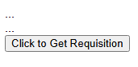
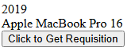

# granola
A library that allows quick and direct access to some Javascript APIs in HTML attributes.

# Example


```html
<div id="div">...</div>
<div id="div2">...</div>
```

```html
<button granola="true" swap="innerHTML" action="get:false@https://api.restful-api.dev/objects/7" targets="#div #div2" js-rest-key="name;data/year">Click to Get Responses</button>
```

```
In order:
Whenever an element is to be analyzed by the library, use the "granola" attribute to indicate this.

The "swap" attribute informs which JS property of the target elements will receive the responses.

The "action" attribute informs: "<method>:<async[true/false]>@<url>".

The "targets" attribute indicates which elements will receive the response to the request.

The "js-rest-keys" attribute informs the JSON path of the response, and may indicate more than one path according to the order of the elements indicated in "targets": "<JSON_PATH_1>;<JSON_PATH_2>;..."
```

Before "onclick":



After "onclick":



```
If you don't want to wait for an action, use the "auto" attribute to automatically initialize requests.
```